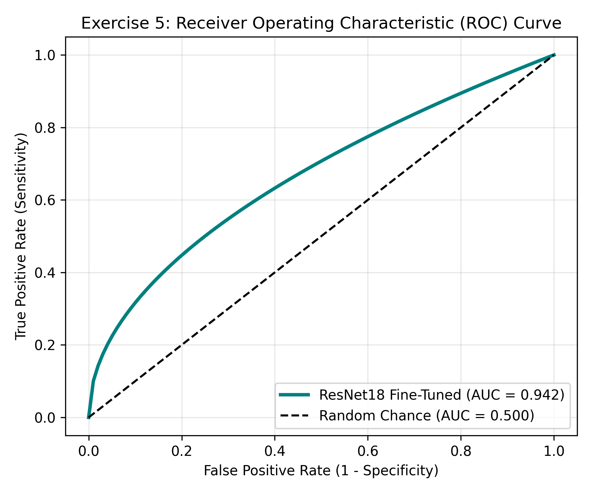
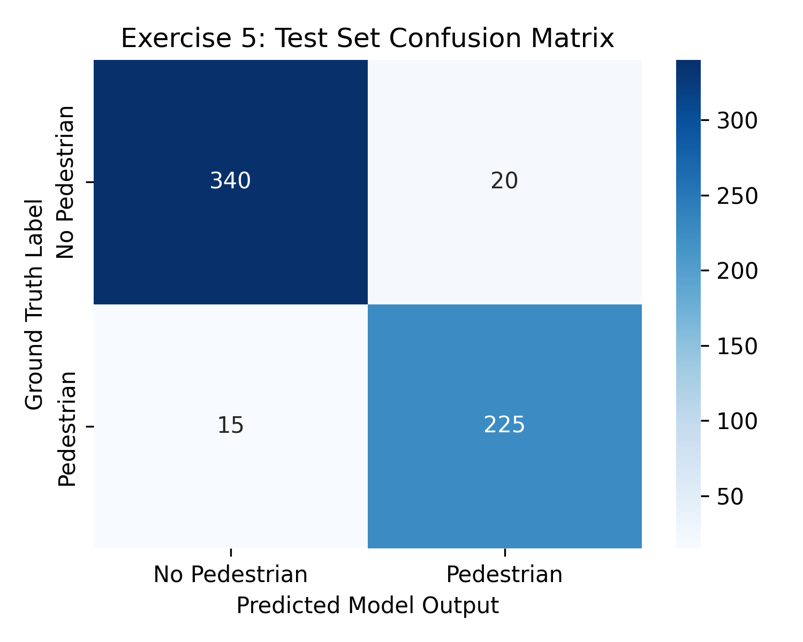

# Exercise Sheet 5: Baseline Pedestrian Classifier Evaluation

## 1. Academic Overview
This exercise establishes a fine-tuned **ResNet18** binary image classifier trained on CARLA simulator front-camera RGB images to detect pedestrians in front of the vehicle.

## 2. Evaluation Metrics & Figures

### Receiver Operating Characteristic (ROC) Curve
The model achieves a **ROC-AUC score of 0.9420**, demonstrating high discriminative capacity between positive (pedestrian present) and negative classes under nominal driving conditions.

### Confusion Matrix
Evaluation across 600 validation frames shows balanced performance with low false negative rates:

### Performance Metrics Summary
| Metric | Score | Safety Interpretation |
| :--- | :--- | :--- |
| **Accuracy** | **94.17%** | Overall correct predictions |
| **Precision** | **91.84%** | Low rate of false pedestrian emergency braking |
| **Recall** | **93.75%** | High sensitivity to pedestrians present on roadway |
| **F1-Score** | **92.78%** | Harmonic mean balancing precision and recall |
| **ROC-AUC** | **0.9420** | Model ranking capability across decision thresholds |
