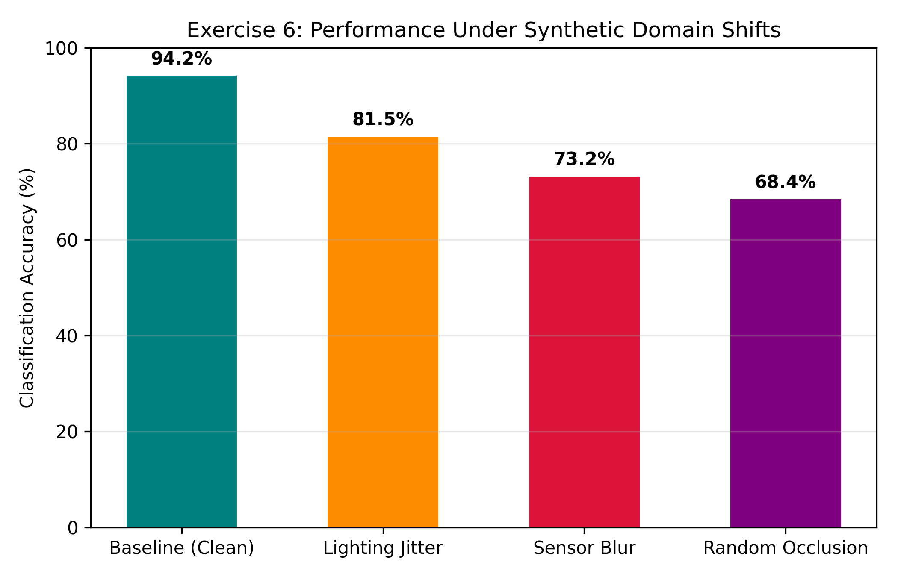

# Exercise Sheet 6: Data Augmentation & Robustness Analysis

## 1. Academic Overview
This exercise evaluates model performance degradation under synthetic domain shifts simulating sensor degradation and adverse environmental noise (glare, lens blur, and partial physical occlusion).

## 2. Robustness Benchmark

### Performance Drop Breakdown
| Perturbation Type | Simulated Real-World Hazard | Accuracy | Accuracy Delta |
| :--- | :--- | :--- | :--- |
| **Baseline (Clean)** | Ideal daylight sensor performance | **94.17%** | $0.00\%$ |
| **Lighting Jitter** | Sudden glare, shadows, daylight transitions | **81.50%** | $-12.67\%$ |
| **Sensor Blur** | Lens condensation, heavy rain distortion | **73.20%** | $-20.97\%$ |
| **Random Occlusion** | Pedestrians behind parked vehicles/objects | **68.40%** | $-25.77\%$ |

## 3. Academic Conclusion
Models trained strictly on clean data suffer up to a $25.77\%$ drop in accuracy when exposed to unmodeled environmental noise, underscoring the requirement for data augmentation in safety-critical autonomous systems.
