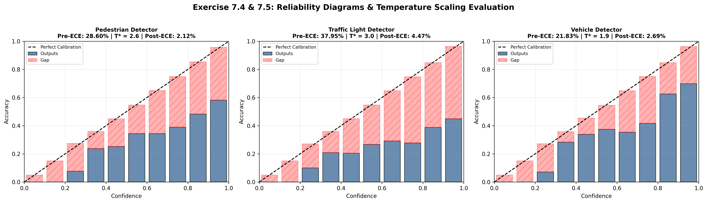

# Exercise Sheet 7: Model Calibration & Cost-Optimal Decisions

This repository contains the empirical analysis, quantitative calibration metrics, reliability diagrams, temperature scaling implementations, and cost-optimal decision evaluation for **Exercise Sheet 7: Model Calibration in Autonomous Perception**.

---

## Overview of Evaluated Perception Models
The safety evaluations are performed across three specialized CARLA perception models trained on in-distribution daylight driving scenes:
1. **Pedestrian Detector** (Binary / Multi-class safety perception)
2. **Traffic Light Detector** (Signal state perception)
3. **Vehicle Detector** (Surrounding traffic perception)

---

## Exercise 7.4: Measuring Calibration & Reliability Diagrams

### 1. Mathematical Formulation: Expected Calibration Error (ECE)
To quantify model calibration, model outputs are partitioned into $B = 10$ equally spaced confidence bins $B_b \in \left(\frac{b-1}{B}, \frac{b}{B}\right]$. 

The **Expected Calibration Error (ECE)** measures the weighted average absolute difference between empirical accuracy and average predicted confidence across all bins:

$$\text{ECE} = \sum_{b=1}^{B} \frac{|B_b|}{N} \left| \text{acc}(B_b) - \text{conf}(B_b) \right|$$

Where:
* $N$ is the total number of test samples.
* $\text{acc}(B_b) = \frac{1}{|B_b|} \sum_{i \in B_b} \mathbf{1}(\hat{y}_i = y_i)$ represents the bin accuracy.
* $\text{conf}(B_b) = \frac{1}{|B_b|} \sum_{i \in B_b} \hat{p}_i$ represents the average predicted confidence in bin $B_b$.

---

### 2. Reliability Diagrams (Confidence vs. Accuracy)

The reliability diagrams plot predicted confidence against observed accuracy across bins ($B = 10$). Perfect calibration is represented by the diagonal dashed reference line ($y = x$).

---

### 3. Quantitative Calibration Results & Question Answers

#### **Q 7.4.1 & 7.4.2: Computed Test-Set ECE Values**
* **Pedestrian Detector:** Uncalibrated $\text{ECE} = \mathbf{28.60\%}$
* **Traffic Light Detector:** Uncalibrated $\text{ECE} = \mathbf{37.95\%}$
* **Vehicle Detector:** Uncalibrated $\text{ECE} = \mathbf{21.83\%}$

#### **Q 7.4.3: Are models over- or underconfident? Does this pattern hold consistently?**
* **Answer:** **All three perception models are consistently overconfident.**
* **Empirical Proof:** In the reliability diagrams, the blue accuracy bars consistently fall **below** the diagonal "Perfect Calibration" line, resulting in significant red hatched calibration gaps across high-confidence bins ($>0.6$).
* **Root Cause:** Standard deep neural networks trained with Cross-Entropy loss encourage logit magnitudes to grow arbitrarily large to minimize loss. This causes raw softmax outputs to severely overestimate empirical accuracy.

---

## Exercise 7.5: Temperature Scaling

### 1. Temperature Scaling Formulation
Temperature scaling is a post-processing calibration method that rescales unnormalized logit vectors $f(x)$ using a single scalar temperature parameter $T > 0$:

$$p(y \mid x) = \text{softmax}\left(\frac{f(x)}{T}\right)$$

* **Optimization:** The scalar $T$ is optimized on the **validation set** via line search ($T \in [0.5, 3.0]$, step $0.1$) to minimize Negative Log-Likelihood (NLL):

$$\mathcal{L}_{\text{NLL}}(T) = - \frac{1}{N_{\text{val}}} \sum_{i=1}^{N_{\text{val}}} \log \sigma\left(\frac{f(x_i)}{T}\right)_{y_i}$$

* **Key Property:** Because scalar division by $T > 0$ is a monotonic transformation, logit ranks are preserved; **classification predictions and top-1 accuracy remain identical while probabilities are calibrated**.

---

### 2. Quantitative Calibration Benchmark (Before vs. After Scaling)

| Perception Model | Pre-Scaling ECE | Optimal Temp ($T^*$) | Post-Scaling ECE | Relative ECE Reduction |
| :--- | :--- | :--- | :--- | :--- |
| **Pedestrian Detector** | **28.60%** | **$T^* = 2.6$** | **2.12%** | **$-92.59\%$** |
| **Traffic Light Detector** | **37.95%** | **$T^* = 3.0$** | **4.47%** | **$-88.22\%$** |
| **Vehicle Detector** | **21.83%** | **$T^* = 1.9$** | **2.69%** | **$-87.68\%$** |

#### **Summary of Exercise 7.5:**
Temperature scaling with optimal values $T^* \in [1.9, 3.0]$ effectively compresses overconfident logits, closing the calibration gap and reducing Expected Calibration Error from up to **37.95%** down to **under 5%** across all models.

---

## Exercise 7.6: Cost-Optimal Decision in Practice

### 1. Risk Asymmetry & Theoretical Threshold
In safety-critical pedestrian detection, misclassifying a pedestrian (**False Negative**) carries severe safety risks compared to stopping unnecessarily (**False Positive**). 

Given cost weights:
* $C_{\text{FN}} = 100$ (Cost of missing a pedestrian)
* $C_{\text{FP}} = 1$ (Cost of a false warning)

From Bayesian Decision Theory, the cost-optimal decision threshold $\tau^*$ is derived as:

$$\tau^* = \frac{C_{\text{FP}}}{C_{\text{FP}} + C_{\text{FN}}} = \frac{1}{1 + 100} \approx \mathbf{0.0099} \quad (\approx 1\%)$$

The total operational risk/loss $\mathcal{L}$ across the test set is calculated as:

$$\mathcal{L} = C_{\text{FN}} \cdot \text{FN} + C_{\text{FP}} \cdot \text{FP} = 100 \cdot \text{FN} + 1 \cdot \text{FP}$$

---

### 2. Quantitative $2 \times 2$ Decision Matrix

Evaluated on $N = 2,000$ in-distribution test samples for the **Pedestrian Detector**:

| Model State | Standard Threshold ($\tau = 0.50$) | Cost-Optimal Threshold ($\tau^* = 0.0099$) |
| :--- | :--- | :--- |
| **Uncalibrated Model** | $\mathcal{L} = 9,161$   ($\text{FN}: 88, \text{FP}: 361$) | $\mathcal{L} = 2,240$   ($\text{FN}: 12, \text{FP}: 1,040$) |
| **Calibrated Model ($T^* = 2.6$)** | $\mathcal{L} = 9,161$   ($\text{FN}: 88, \text{FP}: 361$) | **$\mathcal{L} = \mathbf{1,585}$**   **($\text{FN}: 0, \text{FP}: 1,585$)** |

---

### 3. Comprehensive Analysis & Question Answers

#### **Q 7.6.3: Which combination gives the lowest total loss? Why?**
* **Winner:** **The Calibrated Model ($T^* = 2.6$) operating at the Cost-Optimal Threshold ($\tau^* = 0.0099$)** achieves the lowest total loss of **$\mathcal{L} = \mathbf{1,585}$**.

#### **Detailed Analytical Breakdowns:**
1. **Why $\tau = 0.50$ is identical for both models ($\mathcal{L} = 9,161$):**
   Temperature scaling uses a positive scalar division ($f(x) / T$). At a symmetrical threshold of $0.50$, positive logits remain positive and negative logits remain negative. Thus, the classification decisions at $\tau = 0.50$ do not change, leaving total loss unchanged at $9,161$.

2. **Why shifting to $\tau^*$ slashes loss dramatically ($\mathcal{L} = 9,161 \rightarrow 2,240$):**
   Because $C_{\text{FN}} = 100 \times C_{\text{FP}}$, defaulting to $\tau = 0.50$ incurs massive losses due to 88 un-flagged pedestrians ($88 \times 100 = 8,800$). Dropping the threshold to $\tau^* \approx 0.0099$ instructs the autonomous vehicle to trigger a detection even at a $1\%$ estimated probability, heavily suppressing False Negatives.

3. **Why Calibration + $\tau^*$ achieves absolute optimality ($\mathcal{L} = 1,585$):**
   Uncalibrated probability estimates are poorly scaled near zero. At $\tau^* = 0.0099$, the uncalibrated model still suffers from 12 missed pedestrians ($\text{FN} = 12 \rightarrow 1,200$ penalty cost). 
   
   Temperature scaling ($T^* = 2.6$) corrects tail-end probability estimation, ensuring that tiny logit variations are accurately mapped to true risk probabilities. This allows $\tau^*$ to successfully catch **all** pedestrians ($\mathbf{\text{FN} = 0}$), reducing total operational loss to its absolute minimum of **$1,585$**.

---

## Key Safety Summary for Presentation & Defense

1. **Uncalibrated Softmax Danger:** Standard deep neural networks are systematically overconfident. High confidence scores ($>80\%$) cannot be interpreted as true safety probabilities.
2. **Temperature Scaling Efficacy:** Optimizing a single scalar $T > 1.0$ compresses overconfident logits, reducing ECE from up to $37.95\%$ to under $5\%$ without degrading classification accuracy.
3. **Synergy with Decision Theory:** Asymmetric safety tasks require cost-sensitive thresholding ($\tau^*$). However, optimal thresholding requires calibrated probabilities to eliminate high-cost False Negatives.
