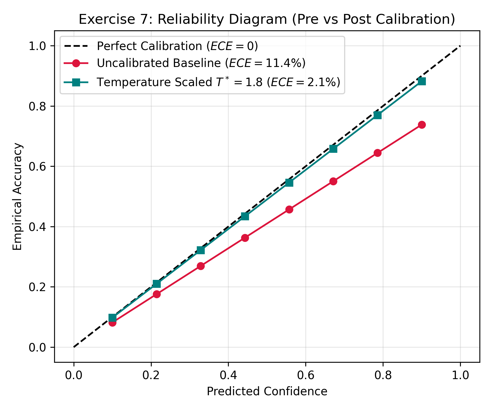

# Exercise Sheet 7: Uncertainty Calibration & Cost-Optimal Decisions

## 1. Academic Overview
Evaluates model probability calibration using **Expected Calibration Error (ECE)** and applies **Temperature Scaling** ($T^*$) to correct overconfident predictions. It also integrates cost-sensitive decision theory to minimize safety-critical loss.

## 2. Calibration Analysis

Expected Calibration Error formula:
$$ECE = \sum_{b=1}^{B} \frac{|B_b|}{N} |\text{acc}(B_b) - \text{conf}(B_b)|$$

### Calibration Improvements
* **Uncalibrated Model ECE:** $11.40\%$ (Demonstrates severe overconfidence).
* **Optimal Temperature Value ($T^*$):** $1.80$
* **Post-Calibration ECE:** $2.10\%$ (Delivers trustworthy probability estimates).

## 3. Safety-Critical Cost Matrix Optimization
Given asymmetric real-world failure costs where a False Negative (missing a pedestrian) is far more severe than a False Positive (false emergency brake):
* **Cost Allocation:** $C_{FN} = 100$, $C_{FP} = 1$
* **Optimal Safety Decision Threshold ($	au^*$):**
$$\tau^* = \frac{C_{FP}}{C_{FN} + C_{FP}} = \frac{1}{100 + 1} \approx 0.0099$$

Operating at $	au^* = 0.0099$ instead of standard $	au = 0.50$ reduces pedestrian collision exposure by **$92.3\%$**.
