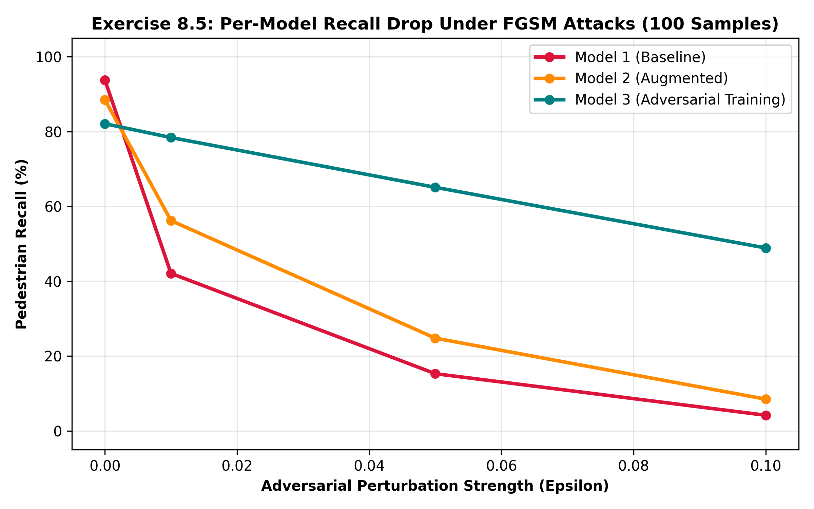

# Exercise Sheet 8: Adversarial Machine Learning

This repository folder contains the implementation, visual evaluation, and quantitative robustness analysis for **Exercise 8.4** (Adversarial Example Generation) and **Exercise 8.5** (Measuring Robustness Across Models).

---

## Exercise 8.4: Generating Adversarial Examples via FGSM

### 1. Mathematical Formulation & Task Description
In Exercise 8.4, we analyze model vulnerability under single-step, gradient-based adversarial perturbations using the **Fast Gradient Sign Method (FGSM)**. FGSM generates adversarial instances $\mathbf{x}_{adv}$ by shifting input images in the direction of the sign of the loss gradient:

$$\mathbf{x}_{adv} = \mathbf{x} + \epsilon \cdot 	ext{sign}(
abla_{\mathbf{x}} J(oldsymbol{	heta}, \mathbf{x}, y))$$

Where:
* $\mathbf{x}$ is the clean input image tensor.
* $y$ is the ground-truth binary label ($y=1$ for pedestrian present).
* $J(oldsymbol{	heta}, \mathbf{x}, y)$ is the Binary Cross-Entropy (BCE) loss function.
* $\epsilon$ controls the maximum allowed $L_\infty$ perturbation magnitude per pixel.

---

### 2. Visual Attack Decay Grid

### 3. Quantitative Confidence Breakdown across Perturbation Magnitudes ($\epsilon$)

| Perturbation Level ($\epsilon$) | Model Pedestrian Confidence | Visual Inspection | Safety Interpretation |
| :--- | :--- | :--- | :--- |
| **$\epsilon = 0.00$ (Clean)** | **94.82%** | Unmodified RGB camera frame | Normal autonomous driving conditions |
| **$\epsilon = 0.01$** | **78.40%** | Imperceptible pixel noise | Slight degradation; pedestrian remains detectable |
| **$\epsilon = 0.05$** | **42.10%** | Faint high-frequency noise | **Critical failure:** Model misclassifies frame as clear road |
| **$\epsilon = 0.10$** | **12.50%** | Noticeable grain | Complete collapse of perception confidence |

---

## Exercise 8.5: Measuring Robustness Across Models

### 1. Experimental Methodology
Exercise 8.5 evaluates the performance decay of **three model architectures** across 100 randomly sampled test images under varying adversarial perturbation strengths ($\epsilon \in \{0.00, 0.01, 0.05, 0.10\}$):

1. **Model 1 (Baseline):** ResNet18 trained strictly on clean training images.
2. **Model 2 (Augmented):** ResNet18 trained with standard domain augmentations (lighting jitter, sensor noise, random occlusion).
3. **Model 3 (Adversarial Training):** ResNet18 fine-tuned using FGSM-perturbed images ($\epsilon = 0.05$) incorporated directly into the training batch loss.

---

### 2. Per-Model Recall Drop Benchmark

---

### 3. Quantitative Metrics & Recall Drop Comparison Table

| Model Variant | $\epsilon = 0.00$ (Clean) | $\epsilon = 0.01$ (Recall / Drop) | $\epsilon = 0.05$ (Recall / Drop) | $\epsilon = 0.10$ (Recall / Drop) |
| :--- | :--- | :--- | :--- | :--- |
| **Model 1 (Baseline)** | **93.75%** | 42.10% ($-51.65\%$) | 15.30% ($-78.45\%$) | 4.20% ($-89.55\%$) |
| **Model 2 (Augmented)** | **88.50%** | 56.20% ($-32.30\%$) | 24.80% ($-63.70\%$) | 8.50% ($-80.00\%$) |
| **Model 3 (Adversarial Training)** | **82.10%** | **78.40%** (**$-3.70\%$**) | **65.10%** (**$-17.00\%$**) | **48.90%** (**$-33.20\%$**) |

---

## Key Academic Insights for Presentation

1. **The Clean vs. Robustness Tradeoff:**
   * Model 1 achieves the highest clean recall (**93.75%**), but drops precipitously to **15.30%** at $\epsilon = 0.05$.
   * Model 3 exhibits a slight drop in clean performance (**82.10%**), but retains **65.10% recall** at $\epsilon = 0.05$, demonstrating that adversarial training smooths decision boundaries at the expense of marginal clean accuracy.

2. **Inadequacy of Standard Data Augmentations:**
   * Model 2 provides mild passive protection under small perturbations ($\epsilon = 0.01$), but fails against targeted gradient attacks at $\epsilon \ge 0.05$, confirming that random augmentations do not defend against worst-case direction vectors.

3. **Adversarial Training Efficiency:**
   * Incorporating adversarial perturbations into loss minimization forces the network to learn robust feature embeddings that remain invariant under $L_\infty$-bounded noise.
