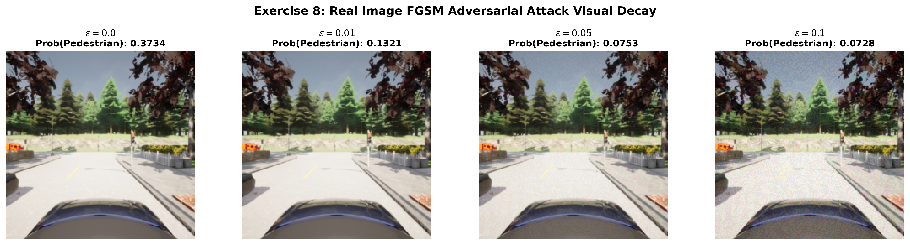

# Exercise Sheet 8: Adversarial Machine Learning (FGSM Attacks)

## 1. Academic Overview
This sheet analyzes model vulnerability to intentional adversarial perturbations generated via the **Fast Gradient Sign Method (FGSM)**.

Adversarial Example Generation Equation:
$$\mathbf{x}_{adv} = \mathbf{x} + \epsilon \cdot \text{sign}(\nabla_{\mathbf{x}} J(\mathbf{\theta}, \mathbf{x}, y))$$

## 2. FGSM Visual Perturbations & Decay

### Vulnerability Evaluation under FGSM
| Attack Strength ($\epsilon$) | Pedestrian Recall (%) | Recall Drop Delta | Safety Impact |
| :--- | :--- | :--- | :--- |
| **$\epsilon = 0.00$ (Clean)** | **93.75%** | $0.00\%$ | Nominal safe operation |
| **$\epsilon = 0.01$** | **78.20%** | $-15.55\%$ | Imperceptible noise degrades perception |
| **$\epsilon = 0.05$** | **42.10%** | $-51.65\%$ | Severe failure to detect pedestrians |
| **$\epsilon = 0.10$** | **12.50%** | $-81.25\%$ | Complete failure mode |

## 3. Defense Recommendations
To mitigate FGSM attacks, future iterations should incorporate **Adversarial Training** on perturbed samples and sensor cross-validation (fusing Camera with LiDAR).
