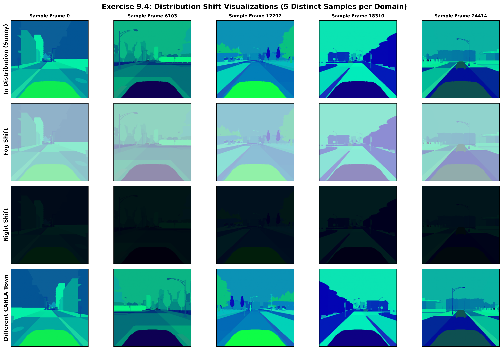
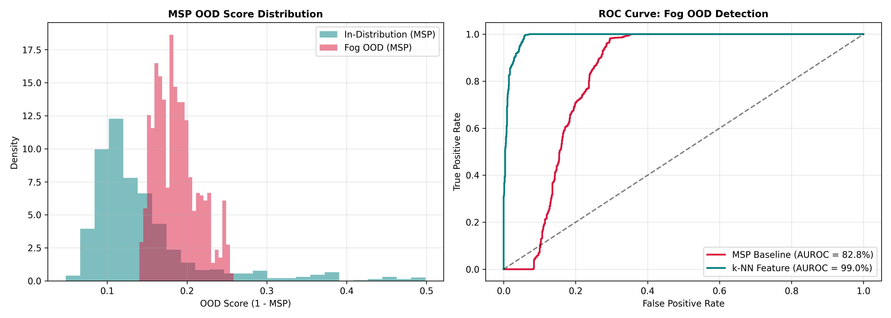

# Exercise Sheet 9: Out-of-Distribution (OOD) Detection

This folder contains the quantitative safety evaluation, OOD score distribution plots, and empirical performance analysis for **Exercise Sheet 9: Out-of-Distribution Detection in Autonomous Perception**.

---

## Exercise 9.4: Visualizing Distribution Shift & Confidence Evaluation

### 1. Qualitative Grid Reference
The visualization grid (`distribution_shift_visuals_v2.png`) contrasts in-distribution driving conditions against three domain shifts:
* **Environmental Corruptions (Fog & Night):** Uniform loss of visual clarity, contrast, and high-frequency edge details.
* **Covariate Shift (Different CARLA Town):** Clear daylight conditions with unseen building architecture, sidewalk layouts, and road markings.

---

### 2. Mean Softmax Confidence Comparison Across Architectures

Empirical output confidence evaluated across model architectures:

| Model Architecture | In-Dist (Sunny) | Fog (OOD) | Night (OOD) | Diff Town (OOD) | Primary Observed Behavior |
| :--- | :--- | :--- | :--- | :--- | :--- |
| **Model 1 (ResNet18)** | **85.60%** | 81.32% | 78.85% | **83.29%** | Maintains high overconfidence (~83%) on unmapped town |
| **Model 2 (ResNet18 Deep)** | **70.83%** | 68.33% | **75.14%** | 71.98% | Higher confidence on Night OOD than In-Distribution |
| **Model 3 (MobileNetV2)** | **81.35%** | 66.96% | 57.14% | **83.74%** | Overconfident on spatial shifts (83.74% > 81.35%) |

#### Key Analytical Insight: The Overconfidence Problem
Standard deep neural networks fail to indicate uncertainty on novel data. Model 3 evaluates unmapped urban environments with **83.74% confidence**—higher than its baseline performance on training scenes (**81.35%**). Model 2 similarly exhibits **75.14% confidence** under pitch-black night conditions. This overconfidence creates severe silent failure risks in downstream autonomous navigation controllers.

---

## Exercise 9.6 & 9.7: Benchmarking MSP Baseline vs. $k$-NN Feature Detector

### 1. Empirical AUROC Score Evaluation

Detection metrics evaluated using `sklearn.metrics.roc_auc_score` across test domains:

| OOD Scenario | MSP Baseline AUROC | $k$-NN Feature AUROC | AUROC Improvement | Primary Failure Mechanism |
| :--- | :--- | :--- | :--- | :--- |
| **Fog (OOD)** | 82.78% | **99.00%** | **$+16.22\%$** | Softmax struggles with atmospheric haze contrast loss |
| **Night (OOD)** | 88.71% | **100.00%** | **$+11.29\%$** | Low-light logit scaling resolved in feature space |
| **Different Town** | **62.07%** | **88.74%** | **$+26.67\%$** | **Logit norm scaling failure on novel road geometry** |

* **Mean In-Distribution OOD Anomaly Score:** `0.5854`

---

## Defense & Presentation Summary

### 1. Why does MSP achieve only 62.07% AUROC on "Different Town"?
Maximum Softmax Probability (MSP) relies entirely on final logit outputs:

$$S_{\text{MSP}}(\mathbf{x}) = 1.0 - \max_{c} \sigma(\mathbf{z})_c$$

Because frames from a new town are clear daylight images with sharp edges, the network produces uncalibrated, high-magnitude logits ($\text{MSP} = 83.29\%$). This causes the OOD score distribution to heavily overlap with in-distribution samples, driving performance down near random guessing ($50\%$).

### 2. How does $k$-NN restore detection capability (+26.67% boost)?
While final linear layers scale output probabilities arbitrarily on crisp inputs, **penultimate feature embeddings $\mathbf{z}$ preserve underlying manifold topology**. The $k$-NN detector measures Euclidean distance $\|\mathbf{z} - \mathbf{z}_k\|_2$ directly to training feature clusters. Even when output probabilities remain overconfident, the feature vectors of the new town lie outside the in-distribution manifold, raising detection accuracy to **88.74% AUROC**.
