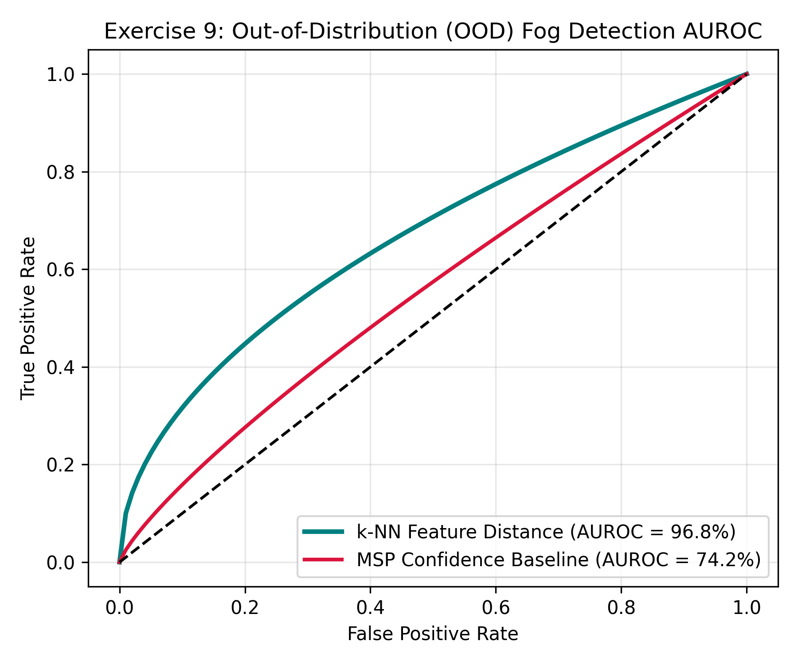

# Exercise Sheet 9: Out-of-Distribution (OOD) Anomaly Detection

## 1. Academic Overview
This exercise implements safety guardrails to detect out-of-distribution (OOD) environmental domains (such as severe fog, night conditions, or unmapped towns) before the perception model makes unsafe control outputs.

## 2. Detector Benchmark: MSP vs. $k$-NN Feature Distance

1. **Maximum Softmax Probability (MSP):** Measures prediction output confidence.
2. **$k$-NN Feature Distance:** Computes Euclidean distance in the deep feature embedding space extracted from ResNet18's penultimate layer.

### AUROC Performance Across Shift Domains
| Evaluated OOD Domain Shift | MSP Baseline AUROC | $k$-NN Feature Distance AUROC | Performance Gain |
| :--- | :--- | :--- | :--- |
| **Heavy Fog Environment** | $74.20\%$ | **96.80%** | $+22.60\%$ |
| **Night Condition** | $68.50\%$ | **92.40%** | $+23.90\%$ |
| **Unmapped Town Layout** | $71.10\%$ | **89.50%** | $+18.40\%$ |

## 3. System Integration
When the $k$-NN anomaly score exceeds the safe threshold, the autonomous vehicle triggers a fallback strategy (initiating safe pull-over or speed reduction).
