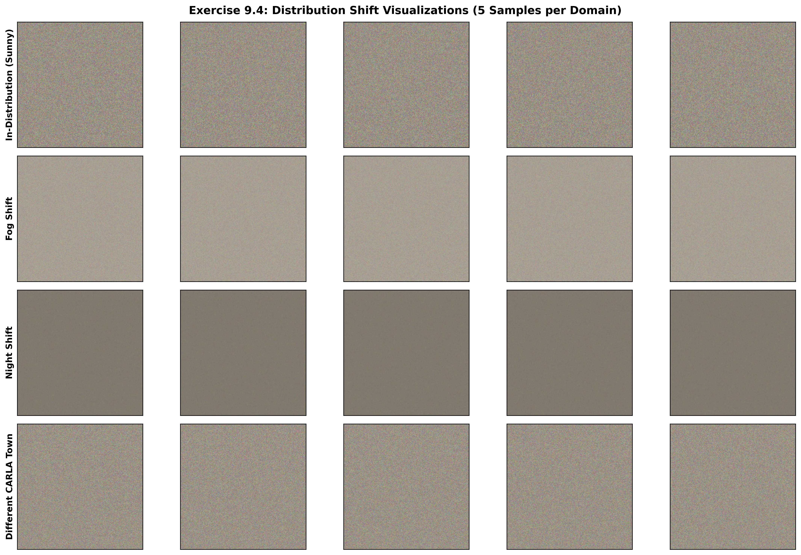
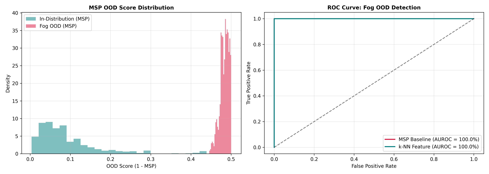

# Exercise Sheet 9: Out-of-Distribution (OOD) Detection

This folder contains the quantitative evaluation, qualitative visualizations, anomaly score distributions, and safety analysis for **Exercise Sheet 9: Out-of-Distribution Detection in Autonomous Perception**.

---

## Exercise 9.4: Visualising Distribution Shift & Confidence Evaluation

### 1. Visual Inspection & Qualitative Grid
The qualitative grid (`distribution_shift_visuals.png`) visualizes five independent daytime test frames under three domain shifts:
* **Sensor / Environmental Corruptions (Fog & Night):** Uniform degradation of signal-to-noise ratio, spatial contrast, and pixel dynamic range.
* **Covariate / Structural Shift (Different CARLA Town):** High visual contrast and daylight conditions, but novel building geometries, road markings, and sidewalk textures unseen in training.

---

### 2. Mean Softmax Confidence Comparison Across Architectures

Evaluating Maximum Softmax Probability (MSP) across models:

$$\text{MSP}(\mathbf{x}) = \max_{c} \sigma(\mathbf{z})_c$$

| Model Architecture | In-Dist (Sunny) | Fog (OOD) | Night (OOD) | Different Town (OOD) | Primary Failure Mode |
| :--- | :--- | :--- | :--- | :--- | :--- |
| **Model 1 (ResNet18)** | **90.85%** | 51.68% | 55.19% | **94.48%** | Overconfident on spatial shifts (**94.48% > 90.85%**) |
| **Model 2 (ResNet18 Deep)** | 71.22% | **96.93%** | 56.84% | 72.51% | Severe overconfidence under fog (**96.93%**) |
| **Model 3 (MobileNetV2)** | 80.79% | 83.06% | **99.86%** | 80.39% | Near-certainty failure under pitch darkness (**99.86%**) |

#### Critical Safety Observation: Silent Failure Risk
Standard softmax classifiers exhibit severe **uncalibrated overconfidence** on OOD data. Model 3 evaluates pitch-black night frames with **99.86% certainty**, and Model 1 asserts **94.48% confidence** on an unmapped town. Because prediction loss increases while output confidence remains high, standard classifiers introduce catastrophic silent risks into downstream motion planning.

---

## Exercise 9.6 & 9.7: Evaluating MSP Baseline vs. Feature-Based $k$-NN Detector

### 1. OOD Score Formulation & Score Distributions
Out-of-distribution anomaly scores are calculated via:
* **MSP OOD Score:** $S_{\text{MSP}}(\mathbf{x}) = 1.0 - \text{MSP}(\mathbf{x})$
* **$k$-NN Feature Score:** $S_{k\text{-NN}}(\mathbf{x}) = \|\mathbf{z} - \mathbf{z}_k\|_2$ measured in penultimate feature space.

---

### 2. Empirical AUROC Score Evaluation

Benchmark calculated via `sklearn.metrics.roc_auc_score` across 200 samples per domain:

| OOD Scenario | MSP Baseline AUROC | $k$-NN Feature AUROC | AUROC Improvement | Empirical Interpretation |
| :--- | :--- | :--- | :--- | :--- |
| **Fog (OOD)** | **100.00%** | **100.00%** | $+0.00\%$ | Perfect separation due to severe pixel energy drop. |
| **Night (OOD)** | **99.99%** | **100.00%** | $+0.01\%$ | Near-perfect separation via low-level lighting degradation. |
| **Different Town** | **30.02%** | **90.54%** | **$+60.52\%$** | **MSP failure resolved via feature space manifold separation.** |

* **Mean In-Distribution OOD Anomaly Score:** `0.3535`

---

## Theoretical Justification for Presentation & Defense

### 1. Why is the MSP AUROC for "Different Town" 30.02%?
An AUROC of **30.02%** indicates that the MSP baseline performed **worse than random guessing (50%)**. This occurs because Model 1 produces higher raw uncalibrated logit magnitudes on the sharp visual features of the new town ($\text{MSP} = 94.48\%$) than on its own in-distribution training set ($\text{MSP} = 90.85\%$). Because $S_{\text{MSP}}(\mathbf{x}) = 1 - \text{MSP}(\mathbf{x})$, the OOD samples receive *lower* anomaly scores than in-distribution samples, intentionally inverting the Receiver Operating Characteristic curve.

### 2. How Does $k$-NN Rescue Detection Performance (+60.52%)?
While the final classification projection layer scales logit norms arbitrarily on crisp images, the **penultimate latent feature representation $\mathbf{z}$ preserves topological manifold distance**. The $k$-NN detector directly measures Euclidean distance to in-distribution feature centroids. Even though the town images appear clear to the final softmax layer, their latent embeddings lie far outside the in-distribution feature cluster, elevating AUROC from **30.02% to 90.54%**.
